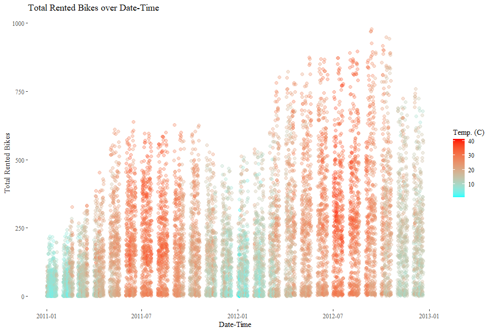
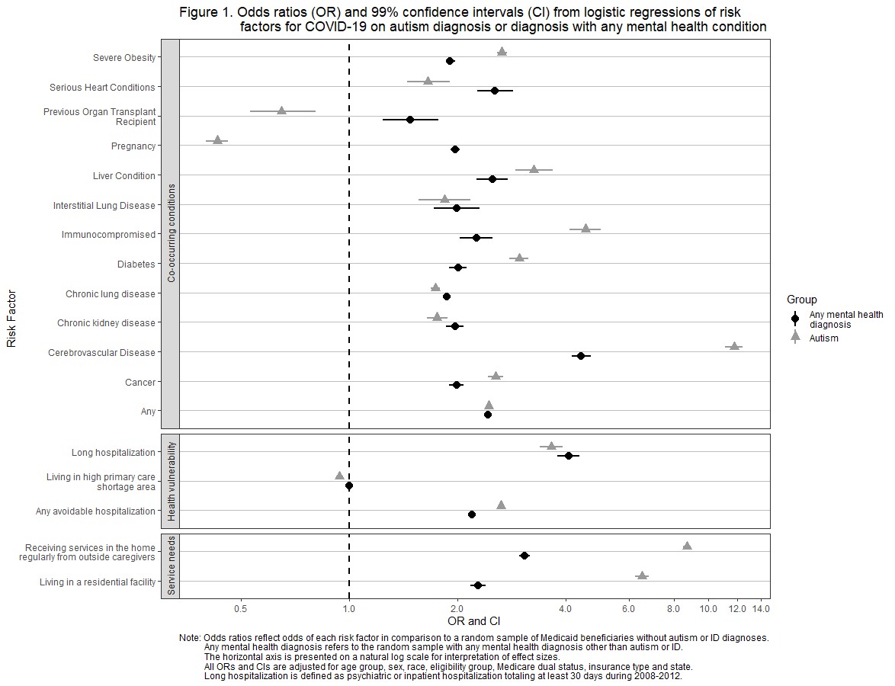

## Publications

---

- Miller, K. H. K., **Becker, A.**, Cooper, D., & Shea, L. (2021). Justice System Interactions Among Autistic Individuals: A Multiple Methods Analysis. Crime & Delinquency. ([Link](https://journals.sagepub.com/eprint/5MIQIDDSTAPQEJSSACRD/full))
- Several more under review and in progress from my work at the [A.J. Drexel Autism Institute](https://drexel.edu/autisminstitute/)

## Data visualization samples

---

 v2.jpg)

